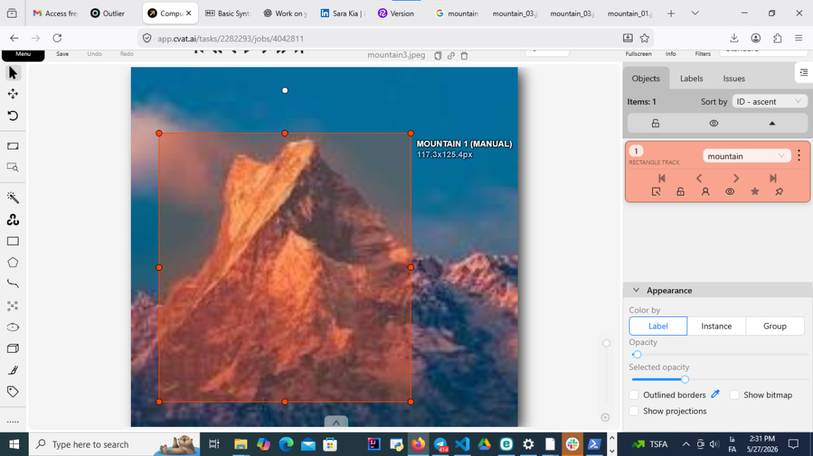
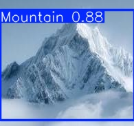

# mountain-detection-yolov8
A practical Computer Vision project for mountain detection using YOLOv8, CVAT, Roboflow, and Ultralytics.
### Manual Annotation in CVAT

This image shows one of my first manually labeled mountain examples using a bounding box in CVAT.

### YOLOv8 Prediction Result

After training with a larger dataset, the model detected the mountain with 88% confidence.

